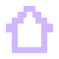

# Organisr 📦📦📦


## Concept
Organisr is an elegant way to take notes for storage. It would be extremely useful for those with a lot of items, specifically small ones. The app allows users to create 'boxes' which represent real life storage containers and add their items. Then, when they want to search for a specific item, they can use the search function to find the location of the item.

Other than that, users can add attributes to items and boxes, like extra information such as description, images and more. This allows customization and it makes sure users can navigate and find information with ease. All the data for boxes and items are saved in local storage so they can be used offline.

## Story
Being really bad at storing items, I was often scolded and well, most frequently, I would forget about where I've stored a certain item and fail to find it. The idea originated from a short that was a tips video, and one of the tips was about using notes to record places of items.

Whenever I try to find something, it may be hidden somewhere,... somewhere deep and never-to-be-seen (who knows!), I'd always think: *my life would be so much better if I had airtags on everything lol.* Though airtags for everything are, let's just say, definitely out of reach (as of now), but this is the alternative!!

I thought that it would be really useful to have an app dedicated to storage notes. It'd feature more advanced capabilities such as adding images, remarks, AI searching, filters and more. For example, there could be a 'box' for the bottom most layer of your snack trolley so you would never miss an expiry date! Or you could also add unused items, so that whenever you want to find them, it would be as easy as a small search in the app!

Thinking practically though, there will be some issues, for example, many items would take a long time to add (btw users can snap a pic of the box and attach it too >w<), in which I will try my best to find a solution!

## Pages (5)
### Home 
The home page consists of a grid like list of all boxes, with a default starter box! Clicking on a box will bring it to a box viewer/info page where the information of the box and included items can be seen.

### Search 
This page has a search bar and returns lists of boxes and items from search. They are displayed in a collapsible, separated by box. It is for easy searching. I will add more advanced functions to assist search in the future!

### Add 
The add page is used to create boxes and add new items. Two buttons navigate to respective forms. It took quite some time though, as it uses some modules like dropdown, images and more.

### Themes 
The themes page can be used to change themes, which I would also add more in the future. Choose from a list of beautiful themes and make it feel like home! Other than that, the main theme for the whole app is pixel, icons are in svg for easy editing.

### Box Viewer
This page is not shown in nav bar as it is hidden. It can be opened from home page by clicking on a box! It opens the page containing information of the box as well as a list of items stored in the box. From there, users can edit/delete the box, as well as move items to other boxes.

## Functions/To Add

### Basic functions

- [x] create boxes and add items
- [x] search
- [x] move items to other box

<br>

### Pages

- [x] home
- [x] search
- [x] new box/item
- [x] themes
- [x] info page (box/item)

<br>

### Expanding functions

- [x] advanced settings like images and expiry date, etc
- [ ] visual to differenciate boxes (eg, boxes with more items are more blue)
- [ ] image search, if possible
- [ ] siri integration (how??)
- [x] themes

<br>

### Future additions
- [ ] filter for easy search
- [ ] item editing
- [ ] more fields

## Developement
After you fork and clone the repository... (from original README)

1. Install dependencies

   ```bash
   npm install
   ```

2. Start the app

   ```bash
    npx expo start
   ```

In the output, you'll find options to open the app in a

- [development build](https://docs.expo.dev/develop/development-builds/introduction/)
- [Android emulator](https://docs.expo.dev/workflow/android-studio-emulator/)
- [iOS simulator](https://docs.expo.dev/workflow/ios-simulator/)
- [Expo Go](https://expo.dev/go), a limited sandbox for trying out app development with Expo

> Web will not work, as some functions cannot be used. If you encounter issues opening project in Expo Go, use `npx expo start --tunnel` instead.

### reanimated-color-picker
I messed around and couldn't figure out how to edit some styles for the swatch, so I've edited `style.ts` (starts line 93) in `node_modules\reanimated-color-picker\lib\src`. Code here:

```
// Swatches
swatchesContainer: {
   flexDirection: 'row',
   flexWrap: 'wrap',
   justifyContent: 'space-between',
},
swatch: {
   width: 30,
   height: 30,
   borderRadius: 5,
   marginHorizontal: 5,
   borderStyle: 'solid',
   borderWidth: 1,
},
```

the edted style is to match the overall theme <3

## Credits
We've used many resources from the internet to create this project. Here's a list of them!

### Fonts
- Digital Disco by [jeti](https://fontenddev.com/fonts/digital-disco/)
- Pixellari by [Zacchary Dempsey-Plante](https://www.dafont.com/pixellari.font)

### Tools
- Vscode
- Figma
- Hackatime
- [svg to jsx](https://react-svgr.com/playground/?native=true)

## Icons
I made some icons using figma for the project, here are some! (home/search/add/theme/close/edit)


### Contact
if you encounter any bugs or so, please feel free to open an issue or email me at m001720@permatapintar.ukm.edu.my<br>
hope you liked the idea of the app!! -candy

<br>

---

<p align="center">Huge thanks to <a href="https://hackclub.com">Hack Club</a> and the <a href="https://cider.hackclub.com">Cider</a> team 💖</p>
